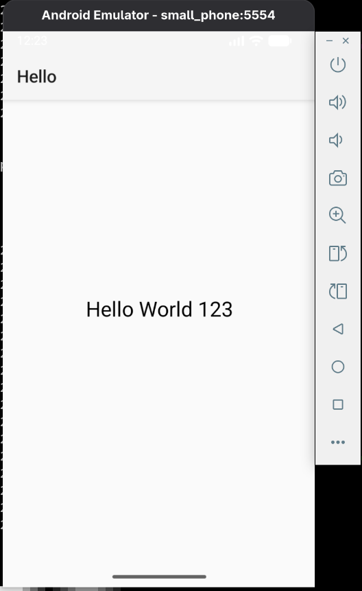

# lightweight android app

- let's create lightweight android-app
- version gradle `8.7`

## setup project

- install android-tools

```sh
sudo dnf install -y android-tools
```

- android emulator, if you need more information, please check out [android-sdk-for-linux](https://github.com/owenwilson/android-sdk-for-linux)

```sh
android emulator start small_phone
```

- verify devices

```sh
adb devices
```

- let's download and dependencies

```sh
gradle wrapper --gradle-version 8.7
# or
./gradlew wrapper --gradle-version 8.7 
```

- compile and install

```sh
./gradlew clean
./gradlew installDebug
```



- stop android emulator

```sh
adb devices
android emulator stop emulator-5554
```

- additional example (optional)

```sh
./gradlew installDebug --continous
./gradlew installDebug -t
```

- mode watch

```sh
./gradlew installDebug --continous
adb shell am start -n com.myapp.hello/.MainActivity
```

- add keystore

```sh
./gradlew assembleRelease
./gradlew bundleRelease
```

## references

- please check out [can you really develop android apps without android studio](https://medium.com/@sdiony/can-you-really-develop-android-apps-without-android-studio-cdd9b951de65)
